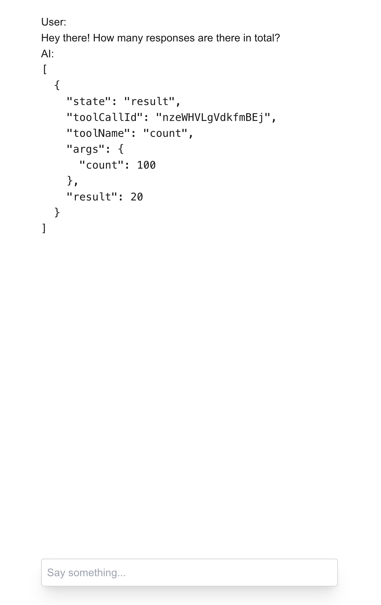

## Mini Project Specification: AI Chat Interface for Data Insights

### **Objective**

Create an AI-driven chat interface that allows users to query and explore insights from a dataset containing survey responses about university students' academic stress and mental health management.

---

### **Scope of the Project**

The goal is to build a web application with the following key features:

1. **AI Chat Interface**:

   - A conversational interface where users can ask natural language questions about the dataset.
   - Example queries:
     - "What are the most common sources of academic stress reported by students?"
     - "How many students rated their mental health below 5?"
     - "What strategies are most frequently used to manage stress?"
     - "What support services do students think would help the most?"

2. **Data Querying**:

   - Process the dataset to provide accurate answers to user queries.

3. **Deployment**:

   - The application must be deployed on a cloud platform (e.g., Vercel, Netlify, AWS, Heroku).

---

### **Requirements**

#### **Core Features**

1. **User Input**:

   - Accept user queries in natural language.
   - Process queries to generate meaningful results based on the dataset.

2. **AI Integration**:

   - Implement a basic AI or NLP solution to parse and understand user queries.
   - The template project uses [Vercel AI SDK](https://sdk.vercel.ai/). However you may use other libraries you are familiar with like [LangChain](https://www.langchain.com/).
   - You can obtain a free API key from Google Gemini [here](https://aistudio.google.com/).

3. **Frontend**:

   - A clean, user-friendly interface for interacting with the chatbot.
   - You may utilise UI component libraries such as [Chakra UI](https://www.chakra-ui.com/), [shadcn](https://ui.shadcn.com/) or [Material UI](https://mui.com/material-ui/).
   - Note that the template project has been loaded with [Tailwind CSS](https://tailwindcss.com/).

4. **Backend** (if applicable):

   - A backend service to handle dataset queries and handle API calls.

5. **Error Handling** (optional):

   - Provide meaningful feedback for invalid or unsupported queries.
   - Sanitise LLM user inputs and design proper guardrails

#### **Bonus Features**

- Visualisations for common data insights (e.g., charts showing stress levels or support services requested).
- A summary section for predefined insights (e.g., top 3 stress sources, average mental health rating).

---

### **Deliverables**

1. **Deployment Link**:

   - A working application deployed and accessible online.

2. **GitHub Repository Link**:

   - A public repository including:
     - Codebase.
     - README file containing a short write up explaining your approach and any considerations or limitations.

## Understanding the Template Project

This template project is built using React, Next.js (App Router), and TypeScript. The files you may edit are enclosed in the `app` folder, specifically:

- `page.tsx`: The root or home page
- `api/chat/route.ts`: An API endpoint to handle user queries (see guide [here](https://sdk.vercel.ai/docs/getting-started/nextjs-app-router))
- `actions/`: A folder containing server functions to process dataset (an example function `countResponses` has been provided for you)

### Prerequisites

Before you begin, ensure you have Node.js installed on your machine. You can download it from [nodejs.org](https://nodejs.org/) or via [homebrew](https://formulae.brew.sh/formula/node) `brew install node` for Mac users.

### Setting Up the Project

1. **Navigate to the project directory:**

   ```bash
   cd data-insights-chat
   ```

2. **Install the dependencies:**

   ```bash
   npm install
   ```

   You may encounter dependency warnings. You may ignore them for the time being.

3. **Run the development server:**

   ```bash
   npm run dev
   ```

4. **Open your browser and visit:**

   [http://localhost:3000](http://localhost:3000)

   You should see the application running.

5. **Try an example query**

   Try typing `How many responses are there in total?`

   

   Ensure that you have obtained and entered a valid Google Gemini API key before doing this.

---

### **Sample Dataset Explanation**

The dataset `responses.csv` provided with this project contains survey responses from university students about their academic stress and mental health management. Below are the headers and descriptions of each column in the dataset:

- **id**: A unique identifier for each response.

- **date**: The timestamp when the response was recorded.

- **What are the main sources of academic stress you experience as a university student?**: Open-ended response where students describe their main sources of academic stress.

- **How often do you feel overwhelmed by your academic workload?**: Selectable options indicating the frequency of feeling overwhelmed by academic workload. Options include: "Never", "Rarely", "Sometimes", "Often", "Always".

- **Which of the following strategies do you use to manage academic stress? (Select all that apply)**: Multiple selections indicating the strategies used by students to manage academic stress. Options include: "Exercise", "Meditation", "Time management", "Seeking help from friends", "Counselling services".

- **On a scale from 1 to 10, how would you rate your overall mental health during the academic year?**: Numeric response where students rate their overall mental health on a scale from 1 to 10.

- **What support services do you think would help improve your academic experience and mental health?**: Open-ended response where students suggest support services that could help improve their academic experience and mental health.

## Note to Applicants

We understand that completing all the features within the mini project can be challenging. The main objective of this project is to assess your technical capabilities and how you approach problem-solving.

**Focus on what you can do best!**

- Feel free to prioritise certain core features.
- You can implement bonus features like visualisations or predefined insights summaries if time permits.
- We encourage you to be creative and utilise any AI code generation tools to assist you in building the project.

**Showcase your skills!**

- We are more interested in your thought process, how you tackle challenges, and the overall functionality of your application.
- In your GitHub repository's README file, document your approach, any libraries or frameworks used, and any limitations your project might have or challenges you faced.

**Don't hesitate to ask for help!**

- If you encounter any difficulties during the development process, feel free to search online resources, explore documentation, or reach out via email.

**This mini project is designed to be a learning experience. We look forward to seeing your solutions!**

## Confidentiality Notice

**We kindly ask you to maintain the confidentiality of the project details and not share them with other applicants or post them online. This ensures a fair assessment for all candidates. Thank you for your understanding and cooperation.**
